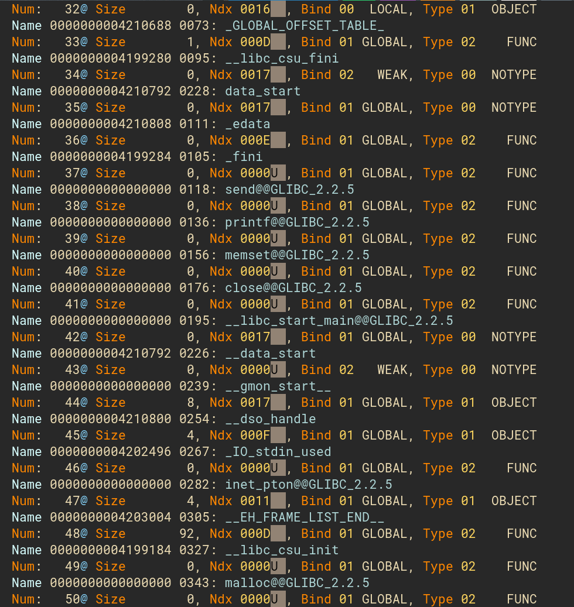

## Dtool Utility

This CommandLine Tool aims at being a generic utility framework, with each tool as a shared library. It provides functions as library calls, so we can build tools more easily.

## Features

- command alias
- distributed packages
- arbitrary option syntax
- simple elf tool
- simple disassembly tool

## Screen Shots




well, color scheme is not very eye friendly.

## How to build

``` bash
cd src
cmake -DCMAKE_INSTALL_PREFIX="$HOME/.local" -B build
make -C build
```

use `make -C build install` to install files to your `$HOME/.local` directory.

binaries will be put under `$HOME/.local/bin` and packages will be put under `$HOME/.local/.mod`.

remember executing `export LD_LIBRARYPATH_PATH` to add module directory path to shared libraries search path.

## Command Line Interface

> The interface is not fully functional for now, user may take cautions when use it.

> if it generates segmentfault or do something strange, that's because the rely relationship check function has not been implemented yet. you may try putting optional options close to command and try again or open an issue and let me know. The fix should be available in next commit.

General Syntax: `dtool subcommand [options..] values...`

## Packages

- [ ] ELF
  > ELF query and manipulation tool, used to extract info from elf files.
- [ ] Lua
- [ ] Unix Calling Table Query Tool
  > Print Linux system call table, Support syscall number query and search.
- [ ] Yara
  > Subset Yara rule syntax with yaml support.
- [ ] Bit Field
  > Display special registers' bit information. For embeded development and kernel hacking.

## TODO

use `ack TODO` in src directory to view all TODOs.
